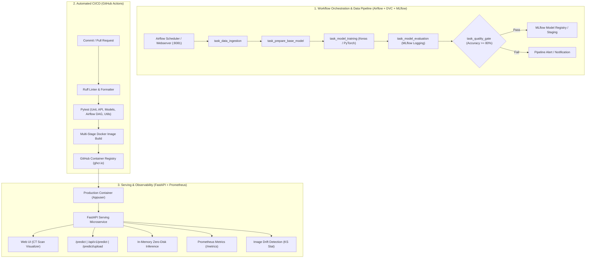

# NephroScan MLOps 🔬

[](https://www.python.org/)
[](https://fastapi.tiangolo.com/)
[](https://airflow.apache.org/)
[](https://pytorch.org/)
[](https://www.tensorflow.org/)
[](https://dvc.org/)
[](https://mlflow.org/)
[](https://www.docker.com/)
[](https://github.com/astral-sh/ruff)
[](LICENSE)

> **NephroScan MLOps** is an enterprise-grade, end-to-end Machine Learning Operations platform designed for clinical CT scan classification (Normal vs. Kidney Tumor). It bridges cutting-edge deep learning research (**PyTorch** and **TensorFlow**) with high-performance production serving (**FastAPI**), workflow orchestration (**Apache Airflow**), reproducible pipelines (**DVC**), experiment tracking (**MLflow**), containerization (**Docker & Compose**), automated **CI/CD**, and production observability (**Prometheus & Drift Detection**).

---

## 📐 System Architecture



---

## 🛠️ Complete Tech Stack

| Category | Tools & Libraries | Purpose & Implementation Details |
| :--- | :--- | :--- |
| **Workflow Orchestration** | **Apache Airflow 2.8+** | DAG orchestration (`dags/kdc_training_pipeline_dag.py`) managing sequential pipeline execution, automated retries, and production model quality gates. |
| **API & Serving** | **FastAPI**, **Uvicorn**, **Pydantic v2**, **Jinja2** | High-throughput asynchronous serving, OpenAPI/Swagger autodocs (`/docs`), strict payload validation, and server-side web UI rendering. |
| **Deep Learning (Production)** | **TensorFlow 2.x**, **Keras** | Transfer learning on VGG16 backbone for kidney CT scan tumor classification. |
| **Deep Learning (Research)** | **PyTorch 2.x**, **Torchvision** | Research architecture (`KidneyPyTorchClassifier`) with ResNet18/VGG16 backbones, custom heads, TorchScript and ONNX export capability. |
| **Model Optimization** | **TorchScript**, **ONNX Runtime** | Serialized model artifacts for low-latency, hardware-accelerated production inference. |
| **Image Processing** | **Pillow (PIL)**, **NumPy**, **SciPy** | Zero-disk in-memory image decoding from Base64/Multipart streams, bilinear normalization, and statistical feature extraction. |
| **Pipeline & Versioning** | **DVC (Data Version Control)** | Multi-stage DAG pipeline (`dvc.yaml`) versioning raw datasets, base models, training runs, and evaluation metrics. |
| **Experiment Tracking** | **MLflow**, **DagsHub** | Tracking parameters, loss curves, confusion matrices, and model artifact registry with remote and local failover. |
| **Packaging & Environment** | **`uv`**, **`pyproject.toml` (PEP 621)** | Sub-second dependency resolution, Hatchling build backend, and modular optional dependency groups. |
| **Containerization** | **Docker**, **Docker Compose** | Multi-stage container builds, non-privileged runtime user (`appuser` UID 10001), health probes, and local 5-tier service orchestration (FastAPI, MLflow, Prometheus, Airflow Webserver, Airflow Scheduler). |
| **Testing & Quality** | **Pytest**, **Pytest-Cov**, **HTTPX** | Comprehensive test suite covering config loading, memory decoders, API routes, Keras and PyTorch models, Airflow DAG integrity, and image drift detection. |
| **Linting & Formatting** | **Ruff** | Lightning-fast static analysis, PEP 8 compliance, auto-formatting, and import sorting. |
| **CI/CD Automation** | **GitHub Actions** | Automated CI workflow (`ci.yml`) for lint, tests, and Docker build smoke test; CD workflow (`cd.yml`) for GHCR container publishing. |
| **Monitoring & Observability** | **Prometheus**, **ImageDriftDetector** | `/metrics` endpoint with latency histograms, and two-sample Kolmogorov-Smirnov statistical tests for input image drift detection. |

---

## ⚡ Quickstart

### 1. Prerequisites & Environment Setup

Using **`uv`** (recommended):
```bash
git clone https://github.com/AbQaadir/NephroScan-MLOps.git
cd NephroScan-MLOps

# Create virtual environment and install all packages
uv venv --python 3.10
source .venv/bin/activate
uv pip install -e ".[all]"
```

Or using standard `pip`:
```bash
python3 -m venv .venv
source .venv/bin/activate
pip install -r requirements-dev.txt
pip install -e .
```

---

### 2. Launch Local Application

```bash
uvicorn app:app --host 0.0.0.0 --port 8080 --reload
```

- **Interactive Web UI**: [http://localhost:8080](http://localhost:8080)
- **Interactive Swagger Docs**: [http://localhost:8080/docs](http://localhost:8080/docs)
- **ReDoc Documentation**: [http://localhost:8080/redoc](http://localhost:8080/redoc)
- **Health Probe**: [http://localhost:8080/health](http://localhost:8080/health)
- **Prometheus Metrics**: [http://localhost:8080/metrics](http://localhost:8080/metrics)

---

### 3. Launch Full MLOps Stack via Docker Compose

Run the API service, local MLflow tracking server, Prometheus, and **Apache Airflow** with a single command:

```bash
docker compose up --build
```

| Service | URL | Credentials | Description |
| :--- | :--- | :--- | :--- |
| **NephroScan API** | `http://localhost:8080` | — | Production model inference service & UI |
| **Airflow Webserver** | `http://localhost:8081` | `admin` / `admin` | DAG orchestration, pipeline triggers, task logs |
| **MLflow Server** | `http://localhost:5000` | — | Experiment runs, metric charts, and model registry |
| **Prometheus** | `http://localhost:9090` | — | Real-time API latency and throughput monitoring |

---

## 🌪️ Apache Airflow Workflow Orchestration

The training and validation lifecycle is managed by the Airflow DAG located in [`dags/kdc_training_pipeline_dag.py`](file:///Users/qaadir/Desktop/dev/MLOPS-Kidney-Disease-Classification/dags/kdc_training_pipeline_dag.py).

### DAG Structure & Tasks:
1. `task_data_ingestion`: Downloads CT scan dataset and extracts zip archives.
2. `task_prepare_base_model`: Initializes pre-trained weights and attaches dense classification head.
3. `task_model_training`: Fits model with real-time data generators and augmentations.
4. `task_model_evaluation`: Evaluates validation accuracy/loss and logs run to MLflow.
5. `task_model_quality_gate`: PythonOperator validating that `accuracy >= 0.80` before allowing model deployment.
6. `pipeline_complete`: End marker acknowledging production promotion readiness.

### Triggering the DAG:
- **Via Web UI**: Open `http://localhost:8081`, locate `kdc_training_pipeline_dag`, and click **Trigger DAG**.
- **Via CLI**:
  ```bash
  docker compose exec airflow-webserver airflow dags trigger kdc_training_pipeline_dag
  ```

---

## 📡 REST API Reference

### 1. JSON Base64 Prediction (`POST /api/v1/predict`)
```bash
curl -X POST "http://localhost:8080/api/v1/predict" \
     -H "Content-Type: application/json" \
     -d '{"image": "<BASE64_STRING>"}'
```

**Response**:
```json
{
  "prediction": "Tumor",
  "confidence": 0.9852,
  "class_index": 1,
  "probabilities": {
    "Normal": 0.0148,
    "Tumor": 0.9852
  },
  "status": "success"
}
```

### 2. Multipart Image Upload (`POST /predict/upload`)
```bash
curl -X POST "http://localhost:8080/predict/upload" \
     -F "file=@inputImage.jpg"
```

### 3. Trigger Asynchronous Training (`POST /train`)
```bash
curl -X POST "http://localhost:8080/train"
```

---

## 🔬 PyTorch Research & Experimentation

For research and experimentation, NephroScan includes a modular PyTorch transfer learning module with TorchScript and ONNX export capabilities:

```python
from KDC.models.pytorch_model import KidneyPyTorchClassifier

# Initialize model with ResNet18 backbone
model = KidneyPyTorchClassifier(num_classes=2, backbone_name="resnet18", pretrained=True)

# Export to TorchScript for production deployment
model.export_torchscript("artifacts/training/model.pt")

# Export to ONNX for cross-platform inference acceleration
model.export_onnx("artifacts/training/model.onnx")
```

Run the complete PyTorch research pipeline:
```bash
python research/pytorch_research_pipeline.py
```

---

## 🔁 DVC Pipeline & Experiment Reproduction

The end-to-end data processing and model training workflow can also be executed via DVC:

```bash
# Reproduce the entire DVC pipeline
dvc repro

# Visualize DVC pipeline DAG
dvc dag
```

---

## 🧪 Testing & Code Quality

```bash
# Code formatting check
ruff format --check .

# Static code analysis and linting
ruff check .

# Execute unit and integration tests with coverage
pytest -v --cov=src/KDC tests/
```

All unit and integration tests validate:
- Image decoders & in-memory stream processing
- Pydantic schema validation
- FastAPI endpoints (`/health`, `/ready`, `/predict`, `/train`, UI)
- Keras & PyTorch forward passes and model exports
- Airflow DAG acyclic integrity and quality gate thresholds
- Image drift detection algorithms

---

## 🚀 CI/CD Automation

- **Continuous Integration (`.github/workflows/ci.yml`)**:
  - Triggers on all pull requests and commits to `main`.
  - Runs Ruff linter and formatter.
  - Executes Pytest test suite with JUnit artifact uploads.
  - Executes a Docker build smoke test.
- **Continuous Deployment (`.github/workflows/cd.yml`)**:
  - Triggers on version tags (`v*.*.*`) or manual workflow dispatch.
  - Builds and pushes multi-platform Docker container images to **GitHub Container Registry (`ghcr.io/AbQaadir/nephroscan-mlops`)**.

---

## 👤 Author

**Abdelqaadir**  
- Email: [qaadireng@gmail.com](mailto:qaadireng@gmail.com)  
- GitHub: [@AbQaadir](https://github.com/AbQaadir)

---

## 📄 License
This project is licensed under the [MIT License](LICENSE).